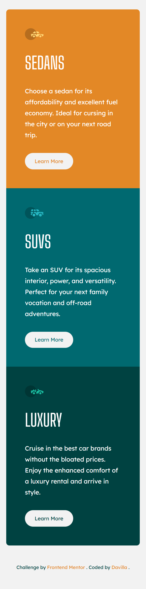
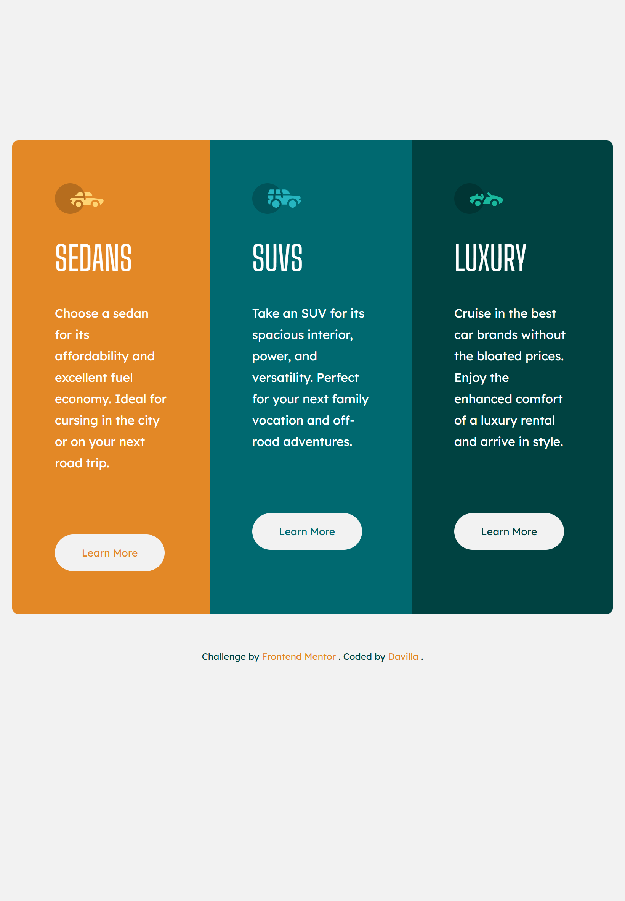
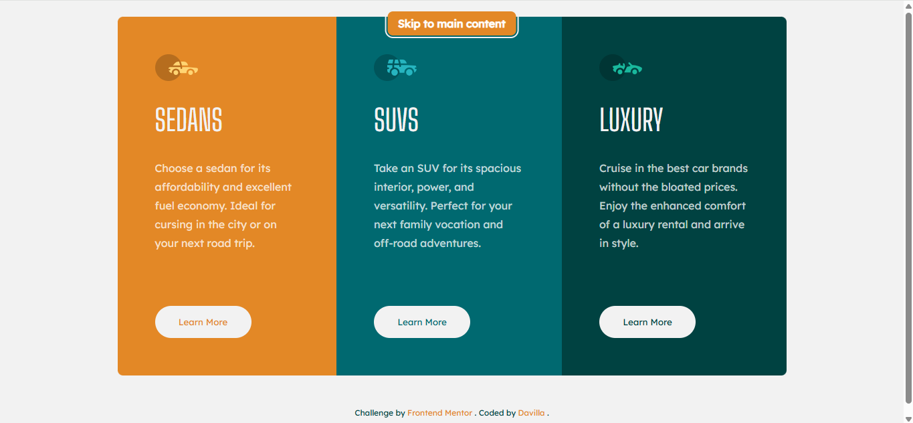

# Frontend Mentor - Solução de 3 Columns Preview Card Component

Esta é uma solução para o [desafio 3 Column Preview Card do Frontend Mentor](https://www.frontendmentor.io/challenges/3column-preview-card-component-pH92eAR2-). Os desafios do Frontend Mentor ajudam você a aprimorar suas habilidades de codificação construindo projetos realistas.

## Sumário

- [Visão geral](#visão-geral)
  - [Captura de tela](#captura-de-tela)
  - [Links](#links)
- [Meu processo](#meu-processo)
  - [Ferramentas utilizadas](#ferramentas-utilizadas)
  - [O que aprendi](#o-que-aprendi)
  - [Desenvolvimento futuro](#desenvolvimento-futuro)
  - [Recursos úteis](#recursos-úteis)
- [Autor](#autor)

## Visão geral

## O desafio

**Os usuários devem ser capazes de:**

- Visualizar o layout ideal dependendo do tamanho da tela do dispositivo
- Ver estados de hover nos elementos interativos
- Navegar pelo conteúdo usando apenas teclado (acessibilidade)
- Experimentar transições suaves respeitando preferências de movimento reduzido

### 📊 Performance & Acessibilidade

| Métrica           | Pontuação |
| ----------------- | --------- |
| ⚡ Performance    | 100%      |
| ♿ Acessibilidade | 95%       |
| 🛡️ Best Practices | 100%      |
| 🔍 SEO            | 100%      |

_Testado com Lighthouse no Chrome DevTools - Março 2026_

### Captura de tela

| Mobile                             | Tablet                             | Desktop                              |
| ---------------------------------- | ---------------------------------- | ------------------------------------ |
|  |  |  |

### Links

- URL da solução: [https://github.com/Davilla07/3-Columns-Preview-Card](https://github.com/Davilla07/3-Columns-Preview-Card/)
- URL do site ao vivo: [https://davilla07.github.io/3-Columns-Preview-Card](https://davilla07.github.io/3-Columns-Preview-Card/)

## Meu processo

### Ferramentas utilizadas

- HTML5 semântico (<main>, <section>, <article>, <footer>)
- Variáveis CSS (Design System organizado por categoria)
- Metodologia BEM para arquitetura CSS escalável
- Função clamp() para tipografia fluida e responsiva
- CSS Grid com grid-template-areas para layout mobile
- Flexbox para layout desktop (3 colunas)
- Fluxo de trabalho mobile-first
- Acessibilidade: skip link, :focus-visible, prefers-reduced-motion, alt descritivo, aria-label

### O que aprendi

Este projeto consolidou técnicas avançadas de CSS e reforçou a importância da acessibilidade como padrão:

**🎨 Layout com Grid Template Areas + Flexbox:**

```css
.container {
  display: grid;
  grid-template-columns: 1fr;
  grid-template-areas:
    "sedans"
    "suvs"
    "luxury";
}

.card--sedans {
  grid-area: sedans;
}
.card--suvs {
  grid-area: suvs;
}
.card--luxury {
  grid-area: luxury;
}

@media (min-width: 768px) {
  .container {
    display: flex;
    flex-direction: row;
  }
}
```

**Aprendizado:**
Aprendi que grid-template-areas torna o código mobile mais legível e semântico. A transição para Flexbox no desktop foi natural e performática.

**📏 Tipografia fluida com clamp():**

```css
:root {
  --fs-lg: clamp(1.5rem, 4vw + 3rem, 2.75rem);
}
```

**Aprendizado:**
clamp(mínimo, ideal, máximo) eliminou a necessidade de múltiplos breakpoints para ajustar fontes. O texto escala suavemente, criando uma experiência orgânica em qualquer tela.

**♿ Acessibilidade como padrão, não exceção:**

```css
/* Skip link funcional */
.skip-link {
  position: absolute;
  top: -100px;
  /* ... */
}
.skip-link:focus {
  top: var(--sp-md);
  outline: 2px solid var(--gray-100);
}

/* Respeitar preferência por movimento reduzido */
@media (prefers-reduced-motion: reduce) {
  *,
  *::before,
  *::after {
    transition-duration: 0.01ms !important;
  }
}
```

**Aprendizado:**
Implementar skip link, :focus-visible e prefers-reduced-motion deixou de ser "extra" para ser parte do meu fluxo padrão. Acessibilidade é experiência do usuário.

## Desenvolvimento Futuro:

- Pré-processadores CSS (SASS) - Variáveis aninhadas, mixins, funções personalizadas
- Metodologia BEM completa - Estrutura bloco\_\_elemento--modificador consistente
- Bootstrap - Componentes responsivos e grid system profissional
- Tailwind CSS - Utility-first para desenvolvimento ágil
- Transições e animações CSS - Keyframes, timing functions, performance
- Acessibilidade avançada - WCAG 2.1, testes com leitores de tela
- CSS Container Queries - Responsividade baseada no container, não viewport

## Autor

- Frontend Mentor - @Davilla07
- GitHub - @Davilla07
